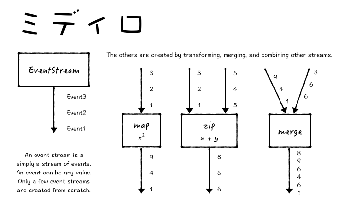
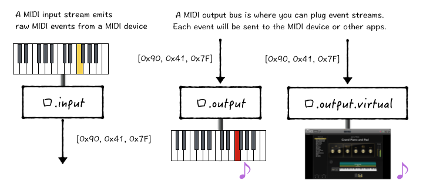
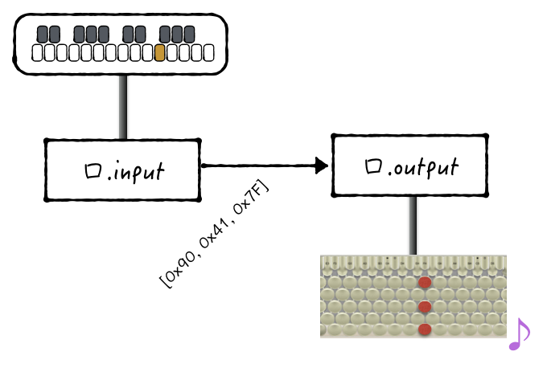
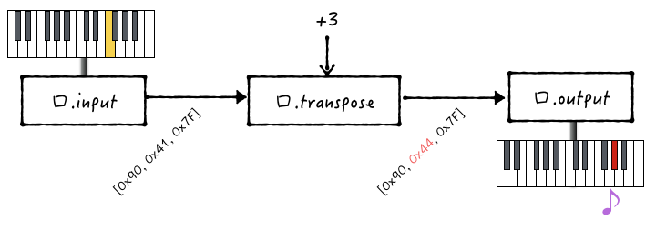
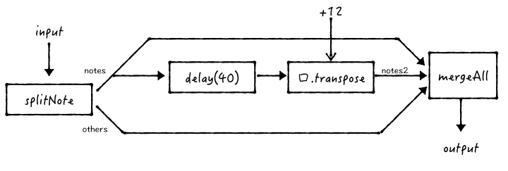

Midiguchi
=========

Midiguchi is a library to let you route and modify MIDI messages
in a very flexible way, thanks to [Bacon.js][].

It's inspired by [Midipipe](http://www.subtlesoft.square7.net/)
but more hacker-friendly.


What you can do with it:
------------------------

* Log MIDI messages from your MIDI input device.
* Route MIDI messages from an input port to output port.
* Transpose notes from your keyboard before it hits your DAW.
* Combine multiple MIDI inputs into one output.
* Perform arbitrary MIDI message manipulations, or even generate them.


Table of Contents
-----------------
* [Basic Concepts](#basic)
    * [Functional Reactive Programming and Bacon.js](#basic-frp)
    * [Input Stream and Output Bus](#basic-io)
* [Usage and Examples](#usage)
    * [List Input and Output Ports](#usage-list)
    * [MIDI Input Stream](#usage-input)
    * [MIDI Output Bus](#usage-output)
    * [MIDI Routing](#usage-routing)
    * [Transposition](#usage-transpose)
    * [Virtual Ports](#usage-virtual)
    * [Remapping Notes](#usage-remap)
    * [Processing Note Events Separately from Other Events](#usage-splitNote)
* [API](#api)
    * [口.input and 口.output](#api-input-output)
    * [口.transpose(stream, transposition)](#api-transpose)
    * [口.mapNote(stream, mapping)](#api-mapNote-object)
    * [口.mapNote(stream, mapper(event, values...), properties)](#api-mapNote-function)
    * [口.splitNote(stream, callback(notes, others))](#api-splitNote)
    * [口.processNote(stream, callback(notes))](#api-processNote)
    * [M = require('midiguchi/midi_util')](#api-util)


## <a name="basic"></a>Basic Concepts


### <a name="basic-frp"></a>Functional Reactive Programming and Bacon.js

If you want to know more about Functional Reactive Programming,
check out [Bacon.js][].
Since Midiguchi is based on Bacon.js,
knowing it will help a lot.

Anyways, here is the basic concept using Bacon.js:
An EventStream emits events.

There are few sources of event streams, such as your MIDI keyboard.
Other streams are created by combining and transforming existing streams.
This allows you to filter, manipulate, and transpose notes easily.




### <a name="basic-io"></a>Input Stream and Output Bus

Midiguchi provides two basic streams for raw MIDI events.




## <a name="usage"></a>Usage and Examples

```coffeescript
口 = require('midiguchi')
```


### <a name="usage-list"></a>List Input and Output Ports

API: [口.input and 口.output](#api-input-output)

```coffeescript
console.log(口.input.ports)
console.log(口.output.ports)
```


### <a name="usage-input"></a>MIDI Input Stream

A MIDI Input Stream is a Bacon.js EventStream from a MIDI port.
It will emit MIDI events.

```coffeescript
input = 口.input.open('nanoKEY2 KEYBOARD')
input = 口.input.open(0)
input = 口.input.virtual('Virtual Input Name')
```

This will log the MIDI messages sent from your keyboard:

```coffeescript
口.input.open('nanoKEY2 KEYBOARD').log()

###
[ 144, 72, 76 ]
[ 128, 72, 64 ]
[ 144, 76, 80 ]
[ 128, 76, 64 ]
[ 144, 79, 127 ]
[ 128, 79, 64 ]
###
```


### <a name="usage-output"></a>MIDI Output Bus

A MIDI Output Bus is a Bacon.js Bus that you can plug EventStreams

```coffeescript
output = 口.output.open('USB MIDI Interface')
output = 口.output.open(0)
output = 口.output.virtual('Virtual Input Name')
```


### <a name="usage-routing"></a>MIDI Routing

This code will route MIDI events from my nanoKEY2 to my Chromatone.

```coffeescript
input = 口.input.open('nanoKEY2 KEYBOARD')
output = 口.output.open('USB MIDI Interface')
output.plug(input)
```




### <a name="usage-transpose"></a>Transposition

My nanoKEY2 cannot transpose notes.
But with Midiguchi this is very easy.

```coffeescript
口 = require('midiguchi')

input = 口.input.open('nanoKEY2 KEYBOARD')
transposed = 口.transpose(input, 3)

output = 口.output.open('USB MIDI Interface')
output.plug(transposed)
```

[口.transpose(stream, transposition)](#api-transpose) is an example of a function.
It takes an EventStream
and returns another EventStream with transposed Note On/Off events.

You can plug the transposed stream into the output, as before.




### <a name="usage-virtual"></a>Virtual Ports

According to [node-midi][]'s documentation,
you can open a virtual port to send MIDI messages into other applications.

As for me, I primarily use my MIDI keyboards with [MainStage][],
so I have to send the MIDI messages through a virtual output
and into MainStage's input.

```coffeescript
口 = require('midiguchi')

input = 口.input.open('nanoKEY2 KEYBOARD')
transposed = 口.transpose(input, 3)

output = 口.output.virtual('Midiguchi')
output.plug(transposed)
```

### <a name="usage-remap"></a>Remapping Notes

Some keyboards with buttons doesn't support note remapping.
You can use Midiguchi to remap them to any key you want.

```coffee
mapping =
38: 36
40: 38
41: 40
43: 50
45: 48
47: 47
48: 45
50: 43

output.plug(口.mapNote(input, mapping))
```

API: [口.mapNote(stream, mapping)](#api-mapNote-object)


You can also use a function to remap notes.
This will map every note to random notes.

```coffee
mapping = (note) ->
# note :: { channel, key, velocity }
note.key = 36 + Math.floor(Math.random() * 49)
return note
```


You can also return an array of notes, and they will be played as a chord.

```coffee
mapping = ({ channel, key, velocity }) ->
note = (add) -> { channel, key: key + add, velocity }
return [note(0), note(4), note(7)]
```

API: [口.mapNote(stream, mapper(event, values...), properties)](#api-mapNote-function)


### <a name="usage-splitNote"></a>Processing Note Events Separately from Other Events

Midiguchi has a `口.splitNote` function that will split one stream into two:
one with note events, and the other without.

This is useful if you want to create some kind of "delay" effect.

In this example, when you hit any note, after 40 milliseconds,
it will also play the same note in the next offset.

This is done by transposing and adding a delay, and merge with original notes stream:

```coffee
result = 口.splitNote(input, (notes, others) ->
notes2 = 口.transpose(notes.delay(40), 12)
Bacon.mergeAll(notes, notes2, others)
)
output.plug(result)
```




A delay effect. Whatever you play, it will play with lower velocity 400ms later, for 3 times:

```coffee
changeVelocity = (multiplier) -> (event) ->
event.velocity *= multiplier
return event

delay = (stream) ->
口.mapNote(stream.delay(400), changeVelocity(0.7))

result = 口.splitNote(input, (notes, others) ->
delay1 = delay(notes)
delay2 = delay(delay1)
delay3 = delay(delay2)
Bacon.mergeAll(notes, delay1, delay2, delay3, others)
)

output.plug(result)
```

API: [口.splitNote(stream, callback(notes, others))](#api-splitNote)


## <a name="api"></a>API

### <a name="api-input-output"></a>口.input and 口.output

```javascript
口.input.ports
口.input.open(number or name)
口.input.virtual(name)

口.output.ports
口.output.open(number or name)
口.output.virtual(name)
```

For usage, see:

* [List Input and Output Ports](#usage-list)
* [MIDI Input Stream](#usage-input)
* [MIDI Output Bus](#usage-output)
* [MIDI Routing](#usage-routing)
* [Virtual Ports](#usage-virtual)


### <a name="api-transpose"></a>口.transpose(stream, transposition)

Returns a transposed version of the stream.
`transposition` can be a number or a Bacon.js Property.

For usage, see [Transposition](#usage-transpose)


### <a name="api-mapNote-object"></a>口.mapNote(stream, mapping)

Returns a stream with notes remapped.

For usage, see [Remapping Notes](#usage-remap)


### <a name="api-mapNote-function"></a>口.mapNote(stream, mapper(event, values...), properties)

Returns a stream with notes remapped. Instead of using a fixed mapping,
you can map them using an arbitrary function.

You can also send Bacon.js properties into `properties` parameter,
and the current value will be sampled into `mapper`'s `values` parameter.

For usage, see [Remapping Notes](#usage-remap)


### <a name="api-splitNote"></a>口.splitNote(stream, callback(notes, others))

Separates the stream into two streams:

1. Stream of note events, `notes`, and
2. Stream of other events, `others`.

Then calls the callback function, and returns whatever that function returns.

Usually, you would modify the notes stream, and merge it back with the others.

For usage, see [Processing Note Events Separately from Other Events](#usage-splitNote).


### <a name="api-processNote"></a>口.processNote(stream, callback(notes))

Just like `口.splitNote` but does not pass `others` to the callback
and merges the `others` back automatically.


### <a name="api-util"></a>M = require('midiguchi/midi_util')

A utility for dealing with MIDI events.

These functions checks if an event is a note on, off, or any note event:

* M.isNoteOn(event)
* M.isNoteOff(event)
* M.isNote(event)


These functions receives a note event, and determines its...

* M.channel(event)
* M.key(event)
* M.velocity(event)


This function constructs a MIDI note event from the arguments:

* M.create.note(on, channel, key, velocity)
* If `on` is true, you get a Note On event.
* If `on` is false, you get a Note Off event.


[node-midi]: https://github.com/justinlatimer/node-midi
[Bacon.js]: https://github.com/baconjs/bacon.js
[MainStage]: http://www.apple.com/mainstage/


